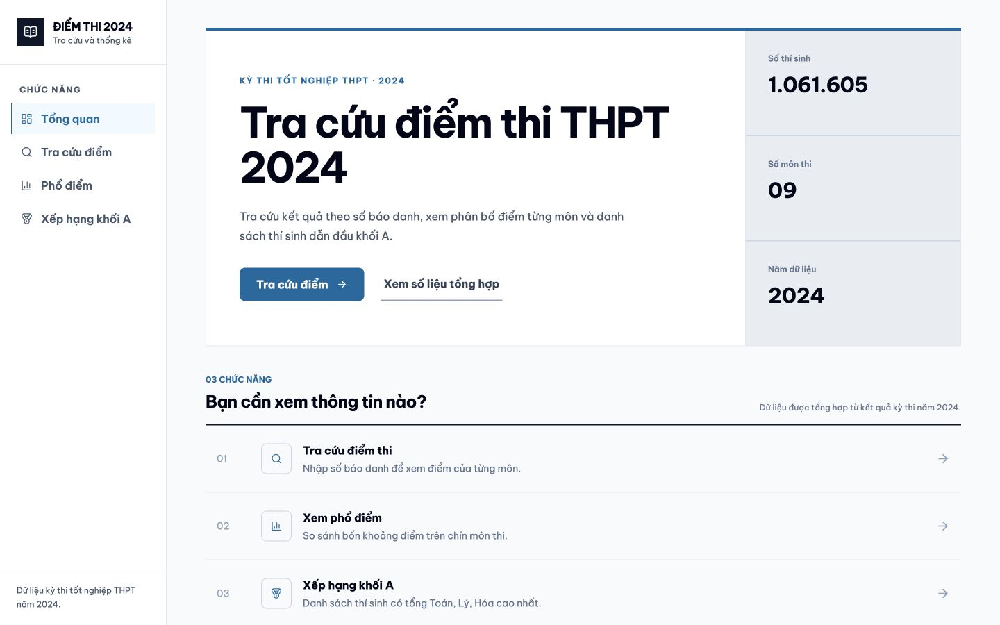
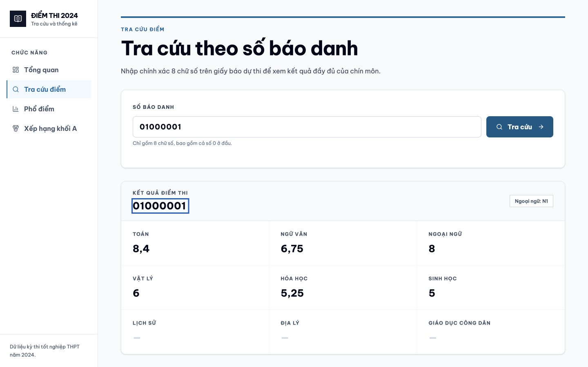
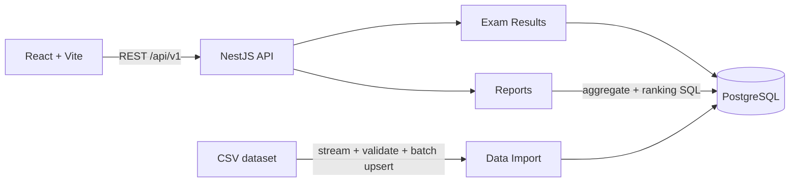

# G-Scores

Search and analyze more than one million results from Vietnam's 2024 National High School Graduation Examination. The project combines a React frontend with a TypeScript modular-monolith backend, with an emphasis on verifiable business rules, memory-efficient data imports, and a clear lookup experience across desktop and mobile devices.

**Live demo:** [Web app](https://goldenowlasia-intern.netlify.app/) · [Swagger API](https://g-scores-api-ea0ea7a5ceca.herokuapp.com/docs) · [Health check](https://g-scores-api-ea0ea7a5ceca.herokuapp.com/health)

**Local Docker:** [Web app](http://localhost:8080) · [Swagger API](http://localhost:3000/docs) · [Health check](http://localhost:3000/health)

**Sample registration number:** `01000001`



## Features

- Look up scores for all nine subjects using an eight-digit registration number.
- View four score bands for every subject while excluding candidates without a score.
- Display the top 10 Group A candidates based on Mathematics, Physics, and Chemistry.
- Stream CSV data in batches, validate every row, and perform idempotent upserts.
- Provide Swagger/OpenAPI documentation, a consistent error envelope, and a PostgreSQL-aware health check.
- Deliver a responsive interface with loading, empty, validation, not-found, and network-error states.



## Tech stack

| Layer    | Technology                                                         |
| -------- | ------------------------------------------------------------------ |
| Frontend | React 19, Vite, TypeScript, Tailwind CSS, TanStack Query, Recharts |
| Backend  | NestJS 11, TypeORM, Joi, Swagger, Helmet                           |
| Database | PostgreSQL (17-alpine locally, Neon in production)                 |
| Testing  | Jest, Supertest, Vitest, React Testing Library                     |
| Runtime  | Docker Compose, multi-stage Docker images, Nginx, Heroku, Netlify  |

## Docker quick start

The only prerequisite is Docker with Docker Compose. The assignment CSV file must be available at `dataset/diem_thi_thpt_2024.csv`.

```bash
cp .env.example .env
docker compose up -d --build --wait
docker compose run --rm backend npm run data:import:prod -w backend -- \
  --file=/data/diem_thi_thpt_2024.csv
```

Open `http://localhost:8080`. Compose runs migrations through a one-shot `migration` service before starting the backend. Import remains an explicit command because the dataset is large and should not delay every application restart. The command is safe to run again and does not create duplicate records.

Inspect or stop the stack with:

```bash
docker compose ps
docker compose logs -f backend
docker compose down
```

`docker compose down` preserves the named database volume. Use `docker compose down -v` only when you intentionally want to delete the local database and import it again from scratch.

## Manual development setup

This setup requires Node.js 22+, npm 10+, and Docker for PostgreSQL.

```bash
cp .env.example .env
npm ci
npm run db:up
npm run migration:run
npm run data:import -- --file=dataset/diem_thi_thpt_2024.csv
npm run dev
```

The development frontend runs at `http://localhost:5173`, while the backend runs at `http://localhost:3000`. The `frontend` and `backend` workspaces share the root lockfile, allowing all dependencies to be installed reproducibly with one command.

## Architecture



The backend is a modular monolith. Modules are separated by capability (`exam-results`, `reports`, `data-import`, `subjects`, and `health`) but are deployed as a single process.

The database uses one wide table for each examination result. Every candidate has exactly one row and the set of subjects is fixed, so lookups require no joins. Score and foreign-language-code constraints are enforced directly by PostgreSQL. Aggregation and Group A ranking are performed in SQL to avoid loading more than one million rows into Node.js.

## Business rules

### Scores and missing values

- Valid scores are between `0` and `10`; PostgreSQL uses `numeric(4,2)` instead of floating-point values.
- Empty CSV cells are stored as `NULL`, not `0`.
- The API always returns all nine subjects. A missing subject score is returned as `score: null`, and the interface displays an em dash (`—`).

### Score distribution

Every non-null score belongs to exactly one band:

| Band              | Condition                  |
| ----------------- | -------------------------- |
| At least 8        | `score >= 8`               |
| From 6 to below 8 | `score >= 6 AND score < 8` |
| From 4 to below 6 | `score >= 4 AND score < 6` |
| Below 4           | `score < 4`                |

### Group A top 10

Only candidates with Mathematics, Physics, and Chemistry scores are eligible. Results use the following deterministic ordering:

1. Three-subject total, descending.
2. Mathematics, Physics, and Chemistry, each descending in that order.
3. Registration number, ascending.

The query uses `ORDER BY ... LIMIT 10`, so the response contains at most ten candidates even when scores are tied.

## API

| Method | Endpoint                             | Purpose                                      |
| ------ | ------------------------------------ | -------------------------------------------- |
| `GET`  | `/api/v1/scores/:registrationNumber` | Look up scores by registration number        |
| `GET`  | `/api/v1/reports/score-distribution` | Return score distributions for nine subjects |
| `GET`  | `/api/v1/reports/top-group-a`        | Return the Group A top 10                    |
| `GET`  | `/health`                            | Check API and database readiness             |
| `GET`  | `/docs`                              | Open Swagger UI                              |

Successful core API responses use a `{ data, meta }` envelope. Error responses contain `statusCode`, an application `code`, `message`, `details`, `path`, and an ISO timestamp. Unexpected errors never expose stack traces, SQL statements, or connection strings.

## Environment variables

| Variable              | Used by          | Description                                              |
| --------------------- | ---------------- | -------------------------------------------------------- |
| `NODE_ENV`            | Backend          | `development`, `test`, or `production`                   |
| `DATABASE_URL`        | Backend/importer | Pooled runtime URL, or the local PostgreSQL URL          |
| `DATABASE_ADMIN_URL`  | Migrations       | Optional direct URL; falls back to `DATABASE_URL`        |
| `TEST_DATABASE_URL`   | Backend tests    | Separate database for integration and end-to-end tests   |
| `PORT`                | Backend          | API port; Heroku supplies this in production             |
| `CORS_ORIGIN`         | Backend          | Comma-separated origin allowlist; wildcards are rejected |
| `VITE_API_URL`        | Frontend build   | Public API base URL embedded by Vite                     |
| `DOCKER_CORS_ORIGIN`  | Compose          | Browser origins allowed to call the containerized API    |
| `DOCKER_VITE_API_URL` | Compose build    | Public API URL embedded in the Vite bundle               |
| `POSTGRES_PORT`       | Compose          | PostgreSQL port exposed to the host                      |
| `BACKEND_PORT`        | Compose          | Backend port exposed to the host                         |
| `FRONTEND_PORT`       | Compose          | Frontend port exposed to the host                        |

The deployed environments use the variables as follows:

- Neon provides the pooled `DATABASE_URL` and the direct `DATABASE_ADMIN_URL` used by migrations.
- Heroku uses `DATABASE_URL`, `DATABASE_ADMIN_URL`, and `CORS_ORIGIN`; Heroku supplies `PORT` automatically.
- Netlify uses `VITE_API_URL` at build time to embed the public HTTPS API base URL.
- `DOCKER_CORS_ORIGIN` and `DOCKER_VITE_API_URL` are only overrides for Docker Compose builds.

Never place secrets in the image or in `VITE_*` variables because those values are publicly visible in the browser bundle.

## Quality checks

```bash
npm run db:up
npm run lint
npm run typecheck
npm test
npm run test:integration -w backend
npm run test:e2e -w backend
npm run build
```

Integration and end-to-end tests run against the real PostgreSQL test database configured through `TEST_DATABASE_URL`; `npm run db:up` creates it during the initial PostgreSQL setup. The test suite prioritizes high-risk rules: score-band boundaries, null handling, database constraints, idempotent imports, duplicate records within a batch, Group A tie-breaking, API errors, and frontend lookup states.

## Security and operations

- Helmet provides HTTP security headers for the API. Its CSP middleware is disabled because Swagger UI requires inline assets.
- CORS accepts only an exact origin allowlist and rejects `*`.
- Joi fails fast when required environment variables are missing or invalid.
- TypeORM always uses `synchronize: false`; schema changes are applied through migrations.
- Production containers do not bind-mount source code. The dataset is mounted read-only for the explicit import command.
- PostgreSQL, the backend, and the frontend all provide health checks; dependent services wait for healthy upstream services.

## Dataset and trade-offs

The CSV file in `dataset/` is the dataset supplied with the assignment. The importer uses a streaming parser and batch upserts instead of PostgreSQL `COPY`. This provides row-level validation, bounded memory usage, and idempotent retries while still processing all `1,061,605` rows, at the cost of lower throughput than raw `COPY`.

The import is not all-or-nothing: completed batches remain committed if a later row is invalid. After correcting the source row, rerunning the import safely upserts existing records without creating duplicates.

Reports run directly against a mostly read-only dataset, so Redis, CQRS, and microservices are intentionally outside the current scope.
